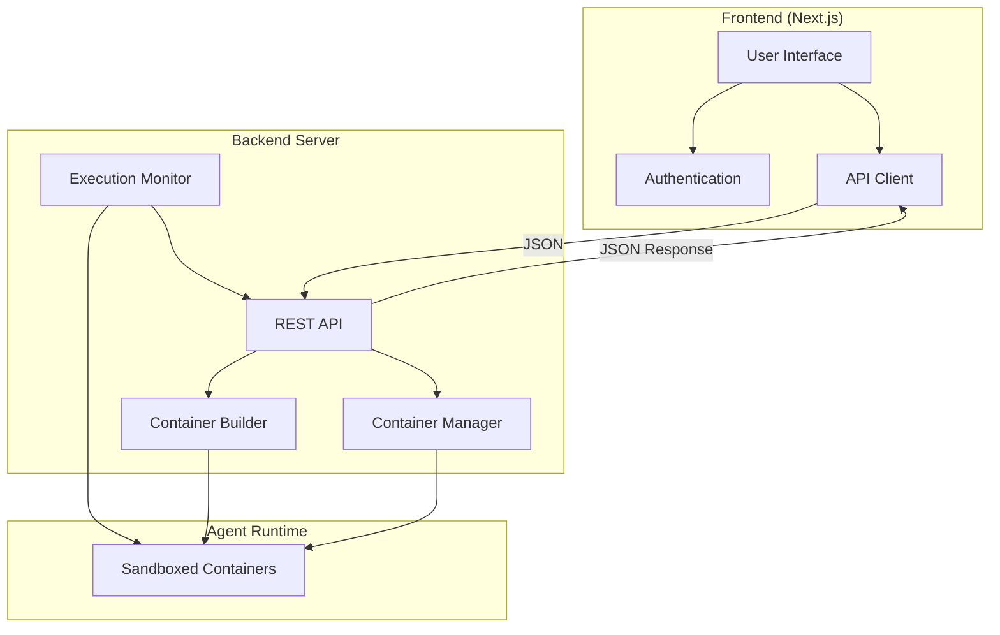

# Veritai Agent Platform Front-End

## Overview

The Veritai Agent Platform is a modern application that enables users to deploy, manage, and monitor AI-powered software agents. The platform provides a streamlined workflow for developers to create agents from GitHub repositories and deploy them with minimal configuration.

## What is Veritai Agent Platform?

Veritai Agent Platform is an innovative solution designed to bridge the gap between AI development and deployment. It allows developers and organizations to:

1. **Simplify AI Agent Deployment**: Transform any AI-powered codebase into a deployable agent with just a few clicks
2. **Standardize Configuration**: Provide a unified interface for setting up environment variables and deployment parameters
3. **Reduce DevOps Overhead**: Automate the provisioning and deployment processes that would traditionally require extensive DevOps knowledge
4. **Enable Rapid Iteration**: Quickly deploy updated versions of agents as development progresses
5. **Centralize Management**: Monitor and manage all deployed agents from a single dashboard

The platform acts as a launchpad for AI agents, abstracting away infrastructure complexities and allowing developers to focus on building intelligent software. By connecting directly to GitHub repositories, it ensures a smooth continuous integration flow from development to production.

## Features

- **Agent Creation**: Easily create new agents by providing a name and GitHub repository URL.
- **Environment Variables**: Configure environment variables for your agents.
- **Deployment Management**: Deploy agents with a single click and monitor their status.
- **User Authentication**: Secure access to the platform with user authentication.
- **Dashboard**: Centralized dashboard to manage and monitor all deployed agents.

## Architecture
The Veritai Agent Platform uses a client-server architecture with clear separation of concerns:

### Frontend (This Repository)
- Built with Next.js and React
- Provides user interface for agent creation, configuration, and monitoring
- Communicates with backend via REST API
- Handles user authentication and session management

### Backend Server
- Implemented in [launchpad_be](https://github.com/franckc/launchpad_be)
- Processes agent deployment requests
- Builds and manages containers in isolated, sandboxed environments
- Handles the complete agent execution lifecycle:
  - Initialization and startup
  - Runtime monitoring
  - Result collection and storage
  - Shutdown and cleanup

### Communication Flow



The platform's architecture ensures secure, scalable agent deployment while providing developers with a simple interface to manage their AI applications without worrying about infrastructure complexity.

## Installation

1. Install dependencies:
  ```bash
  pnpm install
  ```

2. Create a `.env` file with the following variables:
  ```
  GOOGLE_ID=...                         # Google OAuth credentials
  GOOGLE_SECRET=...                     # Google OAuth credentials
  NEXTAUTH_URL=http://localhost:3000/   # NextAuth URL
  NEXTAUTH_SECRET=...                   # NextAuth secret
  SERVER_URL="http://localhost:8080"    # Backend API URL
  POSTGRES_PRISMA_URL_PGBOUNCER="postgres://...."  # Postgres connection string with connection pooling
  POSTGRES_URL_NON_POOLING="postgres://...."       # Postgres connection string without pooling
  ```


## Agent framework support
The platform currently supports Agents developped using the CrewAI framework. More frameworks to be added soon.
For an example of an agent that can be used for testing deployment, see https://github.com/franckc/crew_agent

## Development

### Useful Commands

#### ShadCN UI Components
Add a new ShadCN component:
```bash
pnpm dlx shadcn@latest add <component_name>
```

#### Database Management with Prisma
Generate a database migration file:
```bash
# Create a migration from changes in Prisma schema, apply it to the database, and trigger generators
prisma migrate dev
```

## Roadmap / TODOs

### Security
- [ ] Add authentication to Next.js API routes
- [ ] Add authentication to Server API calls (Bearer token implementation)

### UI Improvements
- [ ] Add spinner or redirect to status page after clicking "Deploy Agent"

### Data Management
- [ ] Implement periodic refresh of agent run status and output data (backend or frontend)

## License

[Your license information here]